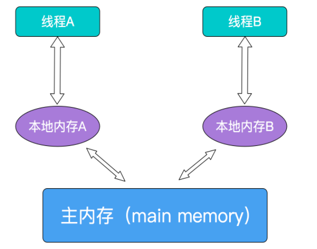

## volatile

### 一、简介
volatile是Java提供的一种轻量级的同步机制。Java 语言包含两种内在的同步机制：同步块（或方法）和 volatile 变量，相比于synchronized（synchronized通常称为重量级锁），volatile更轻量级，因为它不会引起线程上下文的切换和调度。但是volatile 变量的同步性较差（有时它更简单并且开销更低），而且其使用也更容易出错。

### 二、并发编程的3个基本概念
* 原子性

   定义： `即一个操作或者多个操作 要么全部执行并且执行的过程不会被任何因素打断，要么就都不执行。` <br/>
   原子性是拒绝多线程操作的，不论是多核还是单核，具有原子性的量，同一时刻只能有一个线程来对它进行操作。简而言之，在整个操作过程中不会被线程调度器中断的操作，都可认为是原子性。例如 a=1是原子性操作，但是a++和a +=1就不是原子性操作。Java中的原子性操作包括：
   * a. 基本类型的读取和赋值操作，且赋值必须是数字赋值给变量，变量之间的相互赋值不是原子性操作。
   * b.所有引用reference的赋值操作
   *  c.java.concurrent.Atomic.* 包中所有类的一切操作

* 可见性

    定义：`指当多个线程访问同一个变量时，一个线程修改了这个变量的值，其他线程能够立即看得到修改的值。`<br/>
    在多线程环境下，一个线程对共享变量的操作对其他线程是不可见的。Java提供了volatile来保证可见性，当一个变量被volatile修饰后，表示着线程本地内存无效，当一个线程修改共享变量后他会立即被更新到主内存中，其他线程读取共享变量时，会直接从主内存中读取。当然，synchronize和Lock都可以保证可见性。synchronized和Lock能保证同一时刻只有一个线程获取锁然后执行同步代码，并且在释放锁之前会将对变量的修改刷新到主存当中。因此可以保证可见性。

* 有序性
    定义：`即程序执行的顺序按照代码的先后顺序执行。`<br/>
    Java内存模型中的有序性可以总结为：如果在本线程内观察，所有操作都是有序的；如果在一个线程中观察另一个线程，所有操作都是无序的。前半句是指“线程内表现为串行语义”，后半句是指“指令重排序”现象和“工作内存主主内存同步延迟”现象。<br/>
    在Java内存模型中，为了效率是允许编译器和处理器对指令进行重排序，当然重排序不会影响单线程的运行结果，但是对多线程会有影响。Java提供volatile来保证一定的有序性。最著名的例子就是单例模式里面的DCL（双重检查锁）。另外，可以通过synchronized和Lock来保证有序性，synchronized和Lock保证每个时刻是有一个线程执行同步代码，相当于是让线程顺序执行同步代码，自然就保证了有序性。

### 三、锁的互斥和可见性
锁提供了两种主要特性：互斥（mutual exclusion） 和可见性（visibility）。
* （1）互斥即一次只允许一个线程持有某个特定的锁，一次就只有一个线程能够使用该共享数据。
* （2）可见性要更加复杂一些，它必须确保释放锁之前对共享数据做出的更改对于随后获得该锁的另一个线程是可见的。也即当一条线程修改了共享变量的值，新值对于其他线程来说是可以立即得知的。如果没有同步机制提供的这种可见性保证，线程看到的共享变量可能是修改前的值或不一致的值，这将引发许多严重问题。要使 volatile 变量提供理想的线程安全，必须同时满足下面两个条件：
    * a.对变量的写操作不依赖于当前值。
    * b.该变量没有包含在具有其他变量的不变式中。

实际上，这些条件表明，可以被写入 volatile 变量的这些有效值独立于任何程序的状态，包括变量的当前状态。事实上就是保证操作是原子性操作，才能保证使用volatile关键字的程序在并发时能够正确执行。

### 四、Java的内存模型JMM以及共享变量的可见性
JMM决定一个线程对共享变量的写入何时对另一个线程可见，JMM定义了线程和主内存之间的抽象关系：共享变量存储在主内存(Main Memory)中，每个线程都有一个私有的本地内存（Local Memory），本地内存保存了被该线程使用到的主内存的副本拷贝，线程对变量的所有操作都必须在工作内存中进行，而不能直接读写主内存中的变量。



对于普通的共享变量来讲，线程A将其修改为某个值发生在线程A的本地内存中，此时还未同步到主内存中去；而线程B已经缓存了该变量的旧值，所以就导致了共享变量值的不一致。解决这种共享变量在多线程模型中的不可见性问题，较粗暴的方式自然就是加锁，但是此处使用synchronized或者Lock这些方式太重量级了，比较合理的方式其实就是volatile。

需要注意的是，`JMM是个抽象的内存模型，所以所谓的本地内存，主内存都是抽象概念，并不一定就真实的对应cpu缓存和物理内存`

### 五、volatile变量的特性
（1）保证可见性，不保证原子性
> a.当写一个volatile变量时，JMM会把该线程本地内存中的变量强制刷新到主内存中去；<br>
> b.这个写会操作会导致其他线程中的缓存无效。

（2）禁止指令重排
> a.重排序操作不会对存在数据依赖关系的操作进行重排序。<br>
      比如：a=1;b=a; 这个指令序列，由于第二个操作依赖于第一个操作，所以在编译时和处理器运行时这两个操作不会被重排序。<br><br>
> b.重排序是为了优化性能，但是不管怎么重排序，单线程下程序的执行结果不能被改变 <br>
      比如：a=1;b=2;c=a+b这三个操作，第一步（a=1)和第二步(b=2)由于不存在数据依赖关系， 所以可能会发生重排序，但是c=a+b这个操作是不会被重排序的，因为需要保证最终的结果一定是c=a+b=3。

若用volatile修饰共享变量，在编译时，会在指令序列中插入内存屏障来禁止特定类型的处理器重排序,volatile禁止指令重排序也有一些规则：
> a.当程序执行到volatile变量的读操作或者写操作时，在其前面的操作的更改肯定全部已经进行，且结果已经对后面的操作可见；在其后面的操作肯定还没有进行；<br>
>  b.在进行指令优化时，不能将在对volatile变量访问的语句放在其后面执行，也不能把volatile变量后面的语句放到其前面执行。

`即执行到volatile变量时，其前面的所有语句都执行完，后面所有语句都未执行。且前面语句的结果对volatile变量及其后面语句可见。`


### 六、volatile不适用的场景
（1）volatile不适合复合操作
> 例如，inc++不是一个原子性操作，可以由读取、加、赋值3步组成，所以结果并不能达到30000。

（2）解决方法
> 采用synchronized、采用Lock、采用java并发包中的原子操作类，原子操作类是通过CAS循环的方式来保证其原子性的

### 七、volatile原理
volatile可以保证线程可见性且提供了一定的有序性，但是无法保证原子性。在JVM底层volatile是采用`内存屏障`来实现的。观察加入volatile关键字和没有加入volatile关键字时所生成的汇编代码发现，加入volatile关键字时，会多出一个lock前缀指令，lock前缀指令实际上相当于一个内存屏障（也成内存栅栏），内存屏障会提供3个功能：
* 它确保指令重排序时不会把其后面的指令排到内存屏障之前的位置，也不会把前面的指令排到内存屏障的后面；即在执行到内存屏障这句指令时，在它前面的操作已经全部完成；
* 它会强制将对缓存的修改操作立即写入主存；
* 如果是写操作，它会导致其他CPU中对应的缓存行无效。

### 八、单例模式的双重锁为什么要加volatile


```
    public class Instance{
        private Instance(){}
        private volatile static Instance instance=null;
        public static Instance getInstance(){
            if(instance!=null){
                synchronized (Instance.class){
                    if(instance!=null){
                        instance = new Instance();//5
                    }
                }
            }
            return instance;
        }
    }
```
需要volatile关键字的原因是，在并发情况下，如果没有volatile关键字，在第5行会出现问题。instance = new Instance();可以分解为3行伪代码
> 1. memory = allocate()   //分配内存
> 2. ctorInstanc(memory)   //初始化对象
> 3. instance = memory  //设置instance指向刚分配的地址 <br>
>> 上面的代码在编译运行时，可能会出现重排序从1-2-3排序为1-3-2。在多线程的情况下会出现以下问题。线程A在执行第5行代码时，B线程进来，而此时A执行了1和3，没有执行2，此时B线程判断instance不为null，直接返回一个未初始化的对象。

## CAS

```
CAS，在Java并发应用中通常指CompareAndSwap或CompareAndSet，即比较并交换。
```
1. CAS是一个原子操作，它比较一个内存位置的值并且只有相等时修改这个内存位置的值为新的值，保证了新的值总是基于最新的信息计算的，如果有其他线程在这期间修改了这个值则CAS失败。CAS返回是否成功或者内存位置原来的值用于判断是否CAS成功。
2. JVM中的CAS操作是利用了处理器提供的CMPXCHG指令实现的。

优点:
* 竞争不大的时候系统开销小。

缺点:
* 【1】循环时间长开销大。CAS长时间自旋不成功，给CPU带来很大的性能开销。解决方法：JVM能支持pause指令，效率会有一定的提升。
* 【2】只能保证一个共享变量的原子操作。对多个共享变量操作时，不能保证原子性。 解决方法：加锁；共享变量合并成一个共享变量
* 【3】ABA的问题。解决方法就是：增加版本号，每次使用的时候版本号+1，每次变量更新的时候版本号+1。java提供AtomicStampzedReference来解决ABA问题。

## ArrayList线程安全问题
ArrayList非线程安全类，当多线程并发操作会出现异常

* 故障：java.util.ConcurrentModificationException
* 原因：并发争抢修改导致。一个人正在写，另一个过来抢夺，导致数据不一致异常
* 解决方案：
    1. new Vector<>()
    2. Collections.synchronizedList(new ArrayList<>())
    3. new CopyOnWriteArrayList<>()  写方法加锁，读不加锁

## 公平锁/非公平锁
### 公平锁
公平锁是指多个线程按照申请锁的顺序来获取锁。
### 非公平锁
非公平锁是指多个线程获取锁的顺序并不是按照申请锁的顺序，有可能后申请的线程比先申请的线程优先获取锁。有可能，会造成优先级反转或者饥饿现象。

对于Java ReentrantLock而言，通过构造函数指定该锁是否是公平锁，默认是非公平锁。非公平锁的优点在于吞吐量比公平锁大。 对于Synchronized而言，也是一种非公平锁。由于其并不像ReentrantLock是通过AQS的来实现线程调度，所以并没有任何办法使其变成公平锁。

### 可重入锁
广义上的可重入锁指的是可重复可递归调用的锁，在外层使用锁之后，在内层仍然可以使用，并且不发生死锁（前提得是同一个对象或者class），这样的锁就叫做可重入锁。ReentrantLock和synchronized都是可重入锁

## 05 CountDownLatch、Semaphore和CyclicBarrier
### 倒计数器CountDownLatch
```
CountDownLatch(int count) //实例化一个倒计数器，count指定计数个数
countDown() // 计数减一
await() //等待，当计数减到0时，所有线程并行执行
```

### 控制并发访问线程数量Semaphore
```
semaphore.acquire();请求一个信号量，这时候信号量个数-1，当减少到0的时候，下一次acquire不会再执行，只有当执行一个release()的时候，信号量不为0的时候才可以继续执行acquire
semaphore.release();释放一个信号量，这时候信号量个数+1，
```

### 所有线程都等待完成后才会继续下一步行动CyclicBarrier
```
线程调用 await() 表示自己已经到达栅栏
```

## BlockQueue阻塞队列
通过一个共享的队列，可以使得数据由队列的一端输入，从另外一端输出；

### 常用方法
#### 生产
+ add(obj)：往队列里面增加一个对象，如果队列没有空间抛出异常，反之返回true。
+ offer(obj): 往队列增加一个对象，返回true/false
+ put(obj): 往队列增加一个对象，如果没有空间，则会阻塞改线程，直到有空间.
#### 消费
+ poll(time):取出排在首位的对象，如果在一定时间内没有返回，则会返回null
+ take():取出排在首位的对象，如果队列中没有数据，则会阻塞该线程直到有数据。
#### 查询
+ contains(obj):查询是否存在某个元素，返回true/false
+ peek():返回队列头部的元素，无则返回null

### 分类
+ ArrayBlockingQueue 创建固定大小的队列，内部维护一个数组，遵循着FIFO原则
+ linkedblockingqueue,可以自定义队列长度，无指定的情况下默认为Integer.MAX_VALUE，内部维护着一个链表，遵循着FIFO原则
+ PriorityBlockingQueue，类似ArrayBlockingQueue，内部维护一个数组，但并不按照FIFO原则，其内部有个compare属性决定队列任务的执行顺序
+ SynchronousQueue，特殊的队列，内部无存储空间维护队列，只有当生产者和消费者同时存在时，才会执行，类似与管道。
## 生产者消费者

## synchronized与lock有何区别，有何好处
synchronized和Lock.其中synchronized使用Object对象本身的nofify、wait、nofityAll调度机制，而Lock可以使用Condition进行线程之间的调度，完成synchronized实现的所有功能。

+ ReentrantLock 拥有Synchronized相同的并发性和内存语义，此外还多了 锁投票，定时锁等候和中断锁等候
+ synchronized是在JVM层面上实现的，不但可以通过一些监控工具监控synchronized的锁定，而且在代码执行时出现异常，JVM会自动释放锁定，但是使用Lock则不行，lock是通过代码实现的，要保证锁定一定会被释放，就必须将unLock()放到finally{}中
+ 在资源竞争不是很激烈的情况下，Synchronized的性能要优于ReetrantLock，但是在资源竞争很激烈的情况下，Synchronized的性能会下降几十倍，但是ReetrantLock的性能能维持常态；

## Runnable Callable
实现Runnable接口的任务线程无返回值；实现Callable接口的任务线程能返回执行结果.
FutureTask可以包装Callable进行线程执行

## 线程池 ThreadPoolExecutor
构造参数

| 序号 | 名称 | 类型 | 含义 |
|:---:|:---:|:---:|:---:|
| 1 | corePoolSize | int | 核心线程池大小 |
| 2 | maximumPoolSize | int | 最大线程池大小 |
| 3 | keepAliveTime | long | 线程最大空闲时间 |
| 4 | unit | TimeUnit | 时间单位 |
| 5 | workQueue | BlockingQueue<Runnable> | 线程等待队列 |
| 6 | threadFactory | ThreadFactory | 线程创建工厂 |
| 7 | handler | RejectedExecutionHandler | 拒绝策略 |

拒绝策略
+ ThreadPoolExecutor.AbortPolicy 抛出java.util.concurrent.RejectedExecutionException异常
+ ThreadPoolExecutor.CallerRunsPolicy 用于被拒绝任务的处理程序，它直接在 execute 方法的调用线程中运行被拒绝的任务；如果执行程序已关闭，则会丢弃该任务
+ ThreadPoolExecutor.DiscardOldestPolicy 丢弃最前面任务
+ ThreadPoolExecutor.DiscardPolicy 丢弃当前任务

线程池大小配置：
1. 主机cpu核心数*2
2. 最佳线程数目 = （（线程等待时间+线程CPU时间）/线程CPU时间 ）* CPU数目
> 比如平均每个线程CPU运行时间为0.5s，而线程等待时间（非CPU运行时间，比如IO）为1.5s，CPU核心数为8，那么根据上面这个公式估算得到：((0.5+1.5)/0.5)*8=32。
3. 最佳线程数目 = （线程等待时间与线程CPU时间之比 + 1）* CPU数目
> 线程等待时间所占比例越高，需要越多线程。线程CPU时间所占比例越高，需要越少线程。

## jvm
### 常见参数
| 示例参数 | 描述 |
|:---:|:---:|
| -Xms20m | 堆初始值20M |
| -Xmx20m | 堆最大可用值20M |
| -Xmn5m | 新生代最大可用值5M |
| -XX:PrintGC | 触发GC时日志打印 |
| -XX:PrintGCDetails | 触发GC时日志打印更详细 |
| -XX:UseSerialGC | 串行回收 |
| -XX:SurvivorRatio=2 | eden:from:to = 2:1:1 |
| -XX:NewRatio=2 | 新生代:老年代 = 1:2 |

+ 查询虚拟机初始参数：java -XX:+PrintFlagsInitial
+ 查询虚拟机修改之后参数：java -XX:+PrintFlagsFinal -version
+ 查询垃圾收集器：java -XX:+PrintCommandLineFlags 进程号
+ 查询具体参数：jinfo -flag PrintGC 70348

## 强引用、软引用、弱引用、虚引用和引用队列
> 强引用（strong reference）

强引用就是我们最常见的普通对象引用（如new 一个对象），只要还有强引用指向一个对象，就表明此对象还“活着”。在强引用面前，即使JVM内存空间不足，JVM宁愿抛出OutOfMemoryError运行时错误（OOM），让程序异常终止，也不会靠回收强引用对象来解决内存不足的问题。对于一个普通的对象，如果没有其他的引用关系，只要超过了引用的作用域或者显式地将相应（强）引用赋值为null，就意味着此对象可以被垃圾收集了。但要注意的是，并不是赋值为null后就立马被垃圾回收，具体的回收时机还是要看垃圾收集策略的。

> 软引用（soft reference）:SoftReference 内存不够时回收

软引用相对强引用要弱化一些，可以让对象豁免一些垃圾收集。当内存空间足够的时候，垃圾回收器不会回收它。只有当JVM认定内存空间不足时才会去回收软引用指向的对象。JVM会确保在抛出OOM前清理软引用指向的对象，而且JVM是很聪明的，会尽可能优先回收长时间闲置不用的软引用指向的对象，对那些刚构建的或刚使用过的软引用指向的对象尽可能的保留。基于软引用的这些特性，软引用可以用来实现很多内存敏感点的缓存场景，即如果内存还有空闲，可以暂时缓存一些业务场景所需的数据，当内存不足时就可以清理掉，等后面再需要时，可以重新获取并再次缓存。这样就确保在使用缓存提升性能的同时，不会导致耗尽内存。

> 弱引用（weak reference）:WeakReference 发生gc就回收

弱引用指向的对象是一种十分临近finalize状态的情况，当弱引用被清除的时候，就符合finalize的条件了。弱引用与软引用最大的区别就是弱引用比软引用的生命周期更短暂。垃圾回收器会扫描它所管辖的内存区域的过程中，只要发现弱引用的对象，不管内存空间是否有空闲，都会立刻回收它。如同前面我说过的，具体的回收时机还是要看垃圾回收策略的，因此那些弱引用的对象并不是说只要达到弱引用状态就会立马被回收。

> 幻象引用（phantom reference）

幻象引用，也有被说成是虚引用或幽灵引用。幻象引用并不会决定对象的生命周期。即如果一个对象仅持有虚引用，就相当于没有任何引用一样，在任何时候都可能被垃圾回收器回收。不能通过它访问对象，幻象引用仅仅是提供了一种确保对象被finalize以后，做某些事情的机制（如做所谓的Post-Mortem清理机制），也有人利用幻象引用监控对象的创建和销毁。

幻象引用的get方法永远返回null，主要用于检查对象是否已经从内测中删除。

对于软引用、弱引用、幻象引用可以配合引用队列（ReferenceQueue）来使用，特别是幻象引用，get方法只返回null，如果再不指定引用队列，基本就没有任何意义了。

## 垃圾收集器

## linux

+ 整机：top
+ cpu:vmstat  mpstat pidstat
+ 内存：free -m  pidstat -p 进程号 -r 时间
+ 硬盘：df df -h
+ 磁盘IO:iostat  pidstat -p -d
+ 网络IO:ifstat

#### vmstat
vmstat(Virtual Memory Statistics 虚拟内存统计) 命令用来显示Linux系统虚拟内存状态，也可以报告关于进程、内存、I/O等系统整体运行状态。

> 用法
```
vmstat [-a] [-n] [-t] [-S unit] [delay [ count]]
vmstat [-s] [-n] [-S unit]
vmstat [-m] [-n] [delay [ count]]
vmstat [-d] [-n] [delay [ count]]
vmstat [-p disk partition] [-n] [delay [ count]]
vmstat [-f]
vmstat [-V]
```
> 选项
```
-a：显示活跃和非活跃内存
-f：显示从系统启动至今的fork数量 。
-m：显示slabinfo
-n：只在开始时显示一次各字段名称。
-s：显示内存相关统计信息及多种系统活动数量。
delay：刷新时间间隔。如果不指定，只显示一条结果。
count：刷新次数。如果不指定刷新次数，但指定了刷新时间间隔，这时刷新次数为无穷。
-d：显示磁盘相关统计信息。
-p：显示指定磁盘分区统计信息
-S：使用指定单位显示。参数有 k 、K 、m 、M ，分别代表1000、1024、1000000、1048576字节（byte）。默认单位为K（1024 bytes）
-V：显示vmstat版本信息。
```
> 示例


+ Procs（进程）

| r: | 运行队列中进程数量，这个值也可以判断是否需要增加CPU。（长期大于1） |
|:---:|:---:|
| b | 等待IO的进程数量。 |

+ Memory（内存）

| swpd | 使用虚拟内存大小，如果swpd的值不为0，但是SI，SO的值长期为0，这种情况不会影响系统性能。 |
|:---:|:---:|
| free | 空闲物理内存大小。 |
| buff | 用作缓冲的内存大小。 |
| cache | 用作缓存的内存大小，如果cache的值大的时候，说明cache处的文件数多，如果频繁访问到的文件都能被cache处，那么磁盘的读IO bi会非常小。 |

+ Swap

| si | 每秒从交换区写到内存的大小，由磁盘调入内存。 |
|:---:|:---:|
| so | 每秒写入交换区的内存大小，由内存调入磁盘。 |
注意：内存够用的时候，这2个值都是0，如果这2个值长期大于0时，系统性能会受到影响，磁盘IO和CPU资源都会被消耗。有些朋友看到空闲内存（free）很少的或接近于0时，就认为内存不够用了，不能光看这一点，还要结合si和so，如果free很少，但是si和so也很少（大多时候是0），那么不用担心，系统性能这时不会受到影响的。因为linux总是先把内存用光

+ IO

| bi | 每秒读取的块数 |
|:---:|:---:|
| bo | 每秒写入的块数 |
注意：随机磁盘读写的时候，这2个值越大（如超出1024k)，能看到CPU在IO等待的值也会越大。

+ system（系统）

| in | 每秒中断数，包括时钟中断。 |
|:---:|:---:|
| cs | 每秒上下文切换数。 |
注意：上面2个值越大，会看到由内核消耗的CPU时间会越大。

+ CPU（以百分比表示）

| us | 用户进程执行时间百分比(user time) us的值比较高时，说明用户进程消耗的CPU时间多，但是如果长期超50%的使用，那么我们就该考虑优化程序算法或者进行加速。 |
|:---:|:---:|
| sy | 内核系统进程执行时间百分比(system time) sy的值高时，说明系统内核消耗的CPU资源多，这并不是良性表现，我们应该检查原因。 |
| wa | IO等待时间百分比 wa的值高时，说明IO等待比较严重，这可能由于磁盘大量作随机访问造成，也有可能磁盘出现瓶颈（块操作）。 |
| id | 空闲时间百分比 |


## cpu占用过高分析：
1. 先用top命令找出cpu占比最高的
2. ps -ef|grep java或jps进一步定位，得知是一个怎么样的后台程序
3. 定位到具体线程或代码
> 查询进程下的线程：ps -mp 进程号 -o THREAD,tid,time
> -m显示所有的线程
> -p pid进程使用cpu的时间
> -o 该参数后是用户自定义格式
4. 将需要的线程id转换为16进制格式（英文小写）
> printf “%x\n” tid
5. 定位具体代码：
> jstack 进程号 |grep tid(16进制线程id小写英文) -A 60


## github
1. in查询
> springboot in:name,readme,descripition
2. star,fork条件查询
> springboot stars:>=5000
> springboot forks:>500
> springboot stars:100..200 forks:100..200
3. awesome查询
> awesome redis
4. 地区查询
> location:shengzheng language:java
