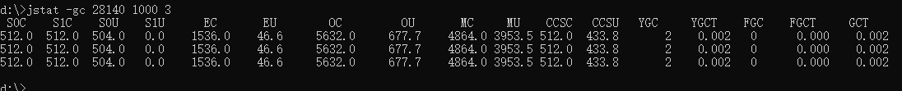

类的加载顺序：
1. 加载：查找并加载类的二进制文件
2. 连接
    - 验证：确保被加载类的正确性
    - 准备：为类的`静态变量`分配内存，并将初始化为`默认值`
    - 解析：把类中的符号引用转换成直接引用
3. 初始化：`为类的静态变量赋予正确的初始值`
4. 使用
5. 卸载

java程序对类的使用分为两种：
+ 主动使用
+ 被动使用

所有的java虚拟机实现必须在每个类或接口被java程序`首次主动使用`时才初始化他们

主动使用（七种）
+ 创建类的实例
+ 访问类或接口的静态变量，或对静态变量赋值
+ 调用类的静态方法
+ 反射（如：Class.forName("com.test.Test")）
+ 初始化一个类的子类
+ java虚拟机启动时被标明为启动类的类
+ jdk1.7开始提供的动态语言支持

类的加载：
+ jvm规范允许类加载器在预料某个类将要被使用时就预先加载它，如果在预先加载的过程中遇到了.class文件缺失或存在错误，类加载器必须在`程序首次主动使用`该类时才报告错误
+ 如果这个类一直没有被程序主动使用，那么类加载器就不会报告错误。

类的初始化：
+ 当java虚拟机初始化一个类时，要求它的所有父类都已经被初始化，但是这条规则并不适用于接口。
    + 在初始化一个类时，并不会先初始化它所实现的接口
    + 在初始化一个接口时，并不会先初始化它的父接口
   因此，一个父接口并不会因为它的子接口或者实现类的初始化而化。只有当程序首次使用特定接口的静态变量时，才会导致该接口的初始化。

类加载器：
+ 根类加载器
+ 扩展类加载器 (加载jar包)
+ 系统类加载器
+ 自定义类加载器

类的卸载：
+ 由java虚拟机自带的类加载器所加载的类，在虚拟机的生命周期中，始终不会被卸载。java虚拟机本身会始终引用这引些类加载器，而这些类加载器则会始终引用它们所加载的类的Class对象，因此这些Class对象始终是可触及的。
+ 由用户自定义的类加载器所加载的类是可以被卸载的。

## java虚拟机工具：
1. jps java process status 查询java进程

参数：
 + m:运行时传入主类参数
 + l:运行主类路径或jar路径
 + v:虚拟机参数

2. jstat 类装载、垃圾收集

参数：
 + -class 显示ClassLoad的相关信息；
 + -gc 显示和gc相关的堆信息；
 + -gcutil 显示垃圾收集信息；
 + -gccapacity 显示各个代的容量以及使用情况；

示例：

+ S0C：年轻代中第一个survivor（幸存区）的容量 （字节）
+ S1C：年轻代中第二个survivor（幸存区）的容量 (字节)
+ S0U ：年轻代中第一个survivor（幸存区）目前已使用空间 (字节)
+ S1U ：年轻代中第二个survivor（幸存区）目前已使用空间 (字节)
+ EC ：年轻代中Eden（伊甸园）的容量 (字节)
+ EU ：年轻代中Eden（伊甸园）目前已使用空间 (字节)
+ OC ：Old代的容量 (字节)
+ OU ：Old代目前已使用空间 (字节)
+ MC：metaspace(元空间)的容量 (字节)
+ MU：metaspace(元空间)目前已使用空间 (字节)
+ CCSC：当前压缩类空间大小
+ CCSU：当前压缩类空间目前已使用
+ YGC ：从应用程序启动到采样时年轻代中gc次数
+ YGCT ：从应用程序启动到采样时年轻代中gc所用时间(s)
+ FGC ：从应用程序启动到采样时old代(全gc)gc次数
+ FGCT ：从应用程序启动到采样时old代(全gc)gc所用时间(s)
+ GCT：从应用程序启动到采样时gc用的总时间(s)

+ S0 ：年轻代中第一个survivor（幸存区）已使用的占当前容量百分比
+ S1 ：年轻代中第二个survivor（幸存区）已使用的占当前容量百分比
+ E ：年轻代中Eden（伊甸园）已使用的占当前容量百分比
+ O ：old代已使用的占当前容量百分比
+ M: 元空间已使用的占当前容量百分比

3. jinfo 查看正在运行的 java 应用程序的扩展参数，包括Java System属性和JVM命令行参数；也可以动态的修改正在运行的 JVM 一些参数

参数：
+ no option 输出全部的参数和系统属性
+ -flag name 输出对应名称的参数
+ -flag [+|-]name 开启或者关闭对应名称的参数
+ -flag name=value 设定对应名称的参数
+ -flags 输出全部的参数
+ -sysprops 输出系统属性

4. jmap 可以生成 java 程序的 dump 文件， 也可以查看堆内对象示例的统计信息、查看 ClassLoader 的信息以及 finalizer 队列。

参数：
+ heap： 显示Java堆详细信息
+ histo[:live]： 显示堆中对象的统计信息
+ clstats：打印类加载器信息
+ dump:< dump-options >：生成堆转储快照  (jmap -dump:format=b,file=heapdump.phrof pid  进程号)

5. jhat 主要是用来分析java堆的命令，分析jmap生成的二进制文件

6. jstack是jdk自带的线程堆栈分析工具

参数：
+ -l 长列表. 打印关于锁的附加信息
+ -F 当’jstack [-l] pid’没有相应的时候强制打印栈信息
+ -m 打印java和native c/c++框架的所有栈信息.
